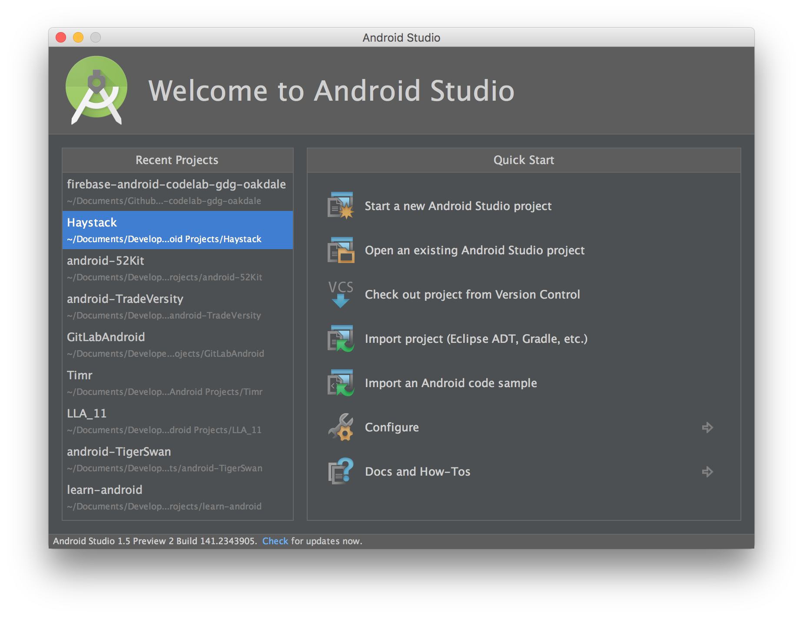
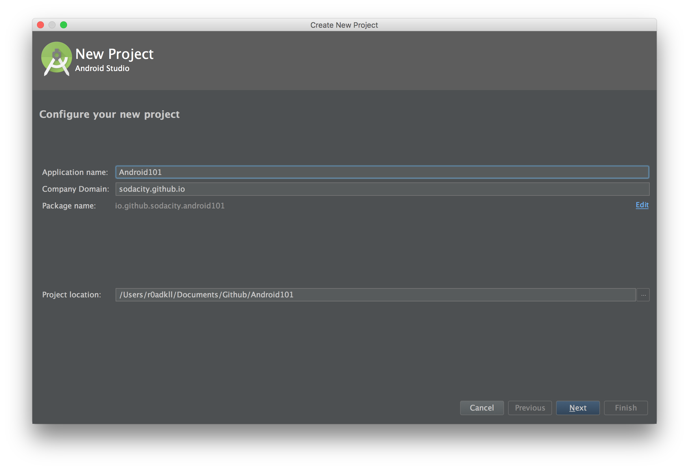
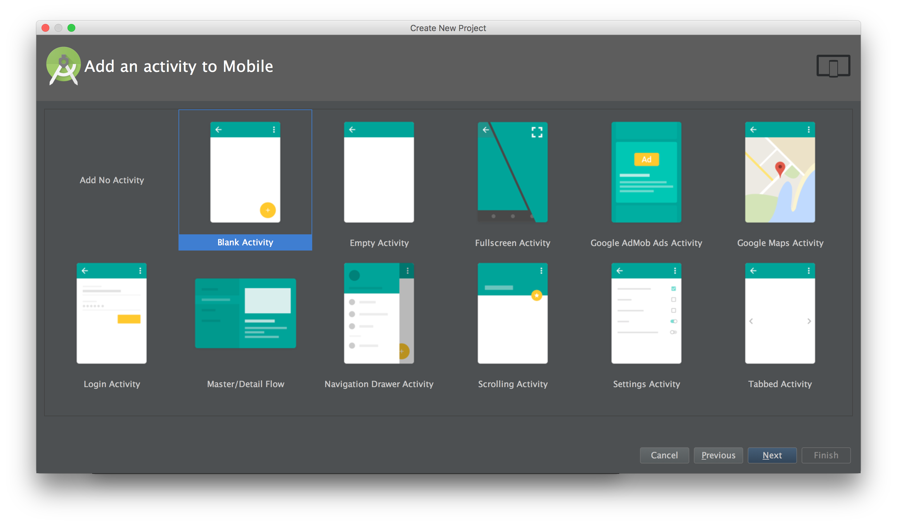
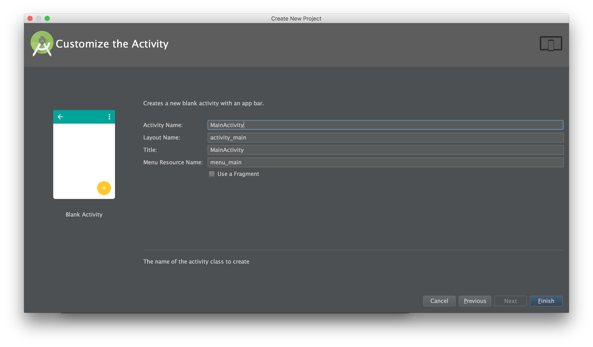

# Welcome

This codelab is designed to help you get started with Android development and become familiar with the basics. During this lab we will create a scrollable gridview of images loaded from the network. 

# Things we'll use

Here are the tools and utilities we will use in this lab:

-	[Android Studio](http://developer.android.com/sdk/index.html) - The IDE for developing Android applications
-	[Material Design Icon Generator](https://github.com/konifar/android-material-design-icon-generator-plugin) - IDE plugin for generating Material Design Icon assets directly into the project
-	[Support Library](http://developer.android.com/tools/support-library/index.html) - A series of libraries that provides extra support outside of the Android SDK for android development including backward compatibility for Material Design and other features and utilities.
	-	[RecyclerView](http://developer.android.com/tools/support-library/features.html#v7-recyclerview) - a view for efficiently displaying large data sets by providing a limited window of data items.
	-	[AppCompat](http://developer.android.com/tools/support-library/features.html#v7-appcompat) - A library that includes support for material design user interface implementations.
-	[Picasso](http://square.github.io/picasso/) - A powerful image downloading and caching library for Android

# Getting Started

Once you've installed Android Studio and Java you be presented with this screen:

From here select `Start a new Android Studio project` and you will be presented with the screen where you will name your project and company domain (i.e.; usually your website, or github address, e.g.; `r0adkll.com` or `r0adkll.github.io`) that is used to generate your applications unique package name that is used as it's identifier when install on a device and in the Playstore.

After entering your project name and domain, you will then be asked to select your minimum target Android SDK. The default is **16** (Jelly Bean 4.1) however I now start my applications at **17** (Jelly Bean 4.2) for the ease of development. 

After selecting your minimum SDK you will be projected to add a template activity to the project (or none if you want to add it yourself) and here you will see a variety of quick start options but for now we will select the **Blank Activity** template to start.

This template will generate an Activity class, a XML layout file for this activity and screen, and a XML layout for an option menu. You will be presented with naming these files in the following screen after continuing.

Once you select _Finish_ Android Studio will create and open your new project to begin developing your Android application.

# The Meat!