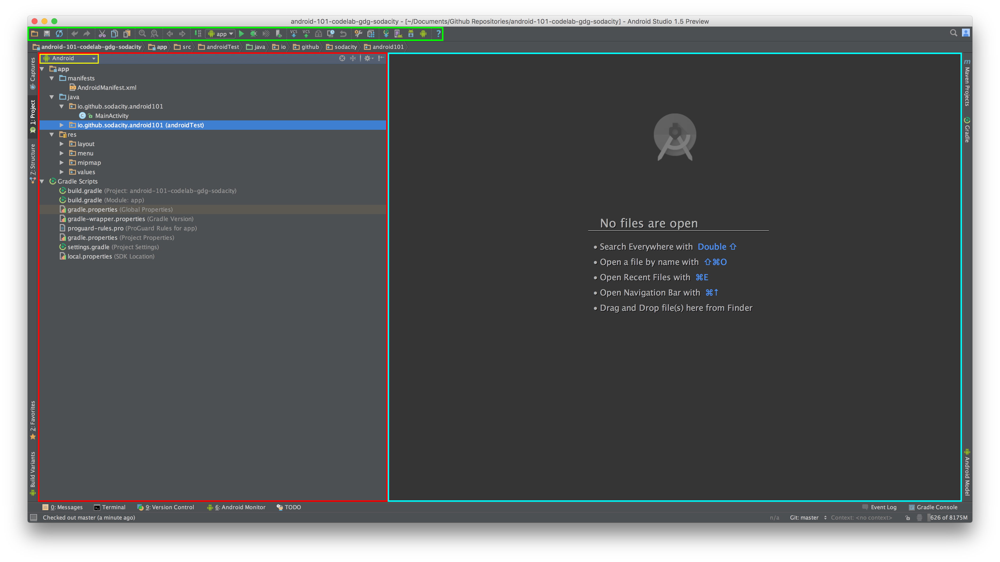

# Welcome

This codelab is designed to help you get started with Android development and become familiar with the basics. During this lab we will create a scrollable gridview of images loaded from the network. 

# Things we'll use

Here are the tools and utilities we will use in this lab:

-	[Android Studio](http://developer.android.com/sdk/index.html) - The IDE for developing Android applications
-	[Material Design Icon Generator](https://github.com/konifar/android-material-design-icon-generator-plugin) - IDE plugin for generating Material Design Icon assets directly into the project
-	[Support Library](http://developer.android.com/tools/support-library/index.html) - A series of libraries that provides extra support outside of the Android SDK for android development including backward compatibility for Material Design and other features and utilities.
	-	[RecyclerView](http://developer.android.com/tools/support-library/features.html#v7-recyclerview) - a view for efficiently displaying large data sets by providing a limited window of data items.
	-	[AppCompat](http://developer.android.com/tools/support-library/features.html#v7-appcompat) - A library that includes support for material design user interface implementations.
-	[Picasso](http://square.github.io/picasso/) - A powerful image downloading and caching library for Android

# Getting Started

Once you've installed Android Studio and Java you be presented with this screen:


From here select `Start a new Android Studio project` and you will be presented with the screen where you will name your project and company domain (i.e.; usually your website, or github address, e.g.; `r0adkll.com` or `r0adkll.github.io`) that is used to generate your applications unique package name that is used as it's identifier when install on a device and in the Playstore.


After entering your project name and domain, you will then be asked to select your minimum target Android SDK. The default is **16** (Jelly Bean 4.1) however I now start my applications at **17** (Jelly Bean 4.2) for the ease of development. 

After selecting your minimum SDK you will be projected to add a template activity to the project (or none if you want to add it yourself) and here you will see a variety of quick start options but for now we will select the **Blank Activity** template to start.


This template will generate an Activity class, a XML layout file for this activity and screen, and a XML layout for an option menu. You will be presented with naming these files in the following screen after continuing.


Once you select _Finish_ Android Studio will create and open your new project which will look a little something like this:



The window outlined in <span style="color: red;">Red</span> is your **Project Structure** which is the tree view of your entire project heirarchy. Within this window you can select between multiple different types of views, for example the default is the **Android** view which presents your projects files, resources, and configuration files in a more streamlined way cutting out the other files in the project that aren't directly need for development. These views are denoted in the <span style="color: gold;">Yellow</span> outline. If you wish to just view the raw file tree then select the **Project** view.

The window outlined in <span style="color: turquoise">Blue</span> is your main editor window, here all your resource and source(read: java) files will appear for you to code and edit. 

The window outlined in <span style="color: limegreen">Green</span> is the **Toolbar** this is where all your basic actions lie such as the basics (open, save, refresh, undo, redo, cut, copy, past) and shortcuts to build/run/debug your project, pull or push to version control, and sync your gradle configuration to the project and open the Android emulator device manager, Android project manager, and extra debugging tools.

# Configuring

Now that we have created our project and become familiar with the basics of the IDE we can begin coding our project! 

First, let's get familiar with the basics for every Android project:

#### *build.gradle* - Gradle build configuration script

If you look under root item `Gradle Scripts` in your **Project Structure** window you will see a list of gradle based files that define how our application is built, but for now we will only focus on the `build.gradle` file, the one that is followed by `(Module: app)`. This is our projects **main** build configuration, and will look like this: 

```
apply plugin: 'com.android.application'

android {
    compileSdkVersion 23
    buildToolsVersion "23.0.1"

    defaultConfig {
        applicationId "io.github.sodacity.android101"
        minSdkVersion 17
        targetSdkVersion 23
        versionCode 1
        versionName "1.0"
    }
    
    buildTypes {
        release {
            minifyEnabled false
            proguardFiles getDefaultProguardFile('proguard-android.txt'), 'proguard-rules.pro'
        }
    }
}

dependencies {
    compile fileTree(dir: 'libs', include: ['*.jar'])
    testCompile 'junit:junit:4.12'
    compile 'com.android.support:appcompat-v7:23.1.0'
    compile 'com.android.support:design:23.1.0'
}
```

I will step through and explain the individual elements of this script that are import to our application:

	apply plugin: 'com.android.application'
	
Here we are applying the Android gradle plugin to the script that tells the build system how to build an Android application from the following defined configuration. (Alternatively if you are building a library project it would be `apply plugin: 'com.android.library'`)

```
android {
    compileSdkVersion 23
    buildToolsVersion "23.0.1"

	...
}
```

Here we set which android sdk version we want to compile with and with what version of the build tools we want to use. These values are set automatically for you when you create a new project, but as you maintain your project these values will need to be updated when a new version of Android or build tools are released.

```
android {
    ...

    defaultConfig {
        applicationId "io.github.sodacity.android101"
        minSdkVersion 17
        targetSdkVersion 23
        versionCode 1
        versionName "1.0"
    }
    
	...
}
```

Here is our default configuration block that defines the basic attributes of the application:

-	`applicationId` - This is the packagename that we talked about earlier, the unique identifier for your application
-	`minSdkVersion` - This is the minimum version of Android that you want your application to run on, this value was determined in the previous project setup process
-	`targetSdkVersion` - This is the Latest version of android you plan on targeting. If you don't set this to the latest version of android that doesn't mean that it _won't_ run on that latest, it just means you can't use any of the new features in the SDK introduced by the latest version. (i.e. if you target Lollipop you wont' get access to the Fingerprint API or the new Permission model).
-	`versionCode` - This is your application's build number. Whenever you release updates this number will have to be larger than the previous release for the user to install it and for the PlayStore to accept it.
-	`versionName` - The version name for your application, this is not required to be changed between updates.

```
android {
    ...

    buildTypes {
        release {
            minifyEnabled false
            proguardFiles getDefaultProguardFile('proguard-android.txt'), 'proguard-rules.pro'
        }
    }
}
```

Here is where our application's build types are defined. By default, the project includes `debug` and `release` where the debug build type is implicit and always defined. You can override it by adding a `debug {}` block under `buildTypes`. 

```
dependencies {
    compile fileTree(dir: 'libs', include: ['*.jar'])
    testCompile 'junit:junit:4.12'
    compile 'com.android.support:appcompat-v7:23.1.0'
    compile 'com.android.support:design:23.1.0'
}
```

Lastly, we have our `dependencies` block where our external (or internal) dependencies are defined and subsequently loaded into our project. By default it is setup to compile and load any JAR files you put in a `libs` folder in the base of the app module. It also includes the App compatibilty and design support libraries for building the latest and greatest UIs that are backwards compatible. 

Here is where you would add any third party libraries that you would want to use to make your development easier such as image loading libraries (Picasso), or networking libraries (OkHttp, Retrofit, Volley, etc...) or anything else you can find. 

I did a presentation on this topic that goes more in depth about this part of the toolchain which you can find on [Speaker Deck](https://speakerdeck.com/r0adkll/posscon-open-source-and-dependency-management-for-android)

---

#### AndroidManifest.xml 

Every Android application contains an AndroidManifest.xml file which is essentially your application's table of contents, or index. It goes further than the build.gradle configuration to define more in-depth and internal aspects of your application. It will look something like this when you first create your application:

```
<?xml version="1.0" encoding="utf-8"?>
<manifest package="io.github.sodacity.android101"
          xmlns:android="http://schemas.android.com/apk/res/android"
    >

	<!--

        This is where you would define the permissions your application needs, such as Internet,
        Location access, access to the external file storage system, bluetooth, and so on...

    -->
    <!-- <uses-permission android:name"..." /> -->

    <!--

        The application definition. Here we specify the Application name('label') that the user sees,
        the application 'icon' displayed in the launcher, and the base theme.

    -->
    <application
        android:allowBackup="true"
        android:icon="@mipmap/ic_launcher"
        android:label="@string/app_name"
        android:supportsRtl="true"
        android:theme="@style/AppTheme"
        >

        <!--

            Each activity you create needs to be defined here under the Application definition
            where you specify the path to the activity relative to the package. You can also specify
            it's default label and override the base application theme.

        -->
        <activity
            android:name=".MainActivity"
            android:label="@string/app_name"
            android:theme="@style/AppTheme.NoActionBar"
            >

            <!--

                Activities can contain Intent Filters, i.e.; a hook for androids communication layer
                that can catch certain messages and display the activity in accordance. For example,
                the following intent filter tells the OS that this activity is the main one and to
                launch it when the user selects the application from the home screen or launcher.

            -->
            <intent-filter>
                <action android:name="android.intent.action.MAIN"/>
                <category android:name="android.intent.category.LAUNCHER"/>
            </intent-filter>
        </activity>

    </application>

</manifest>
```

This example contains documentation breaking down each aspect of this file to explain how it operates.

# The Meat!


